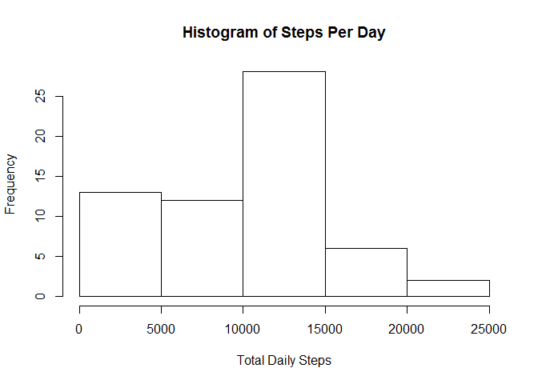
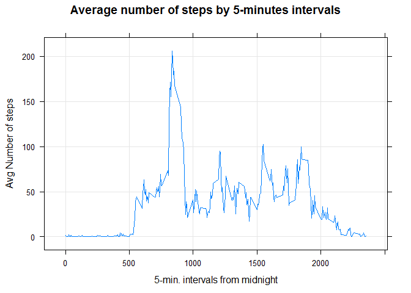
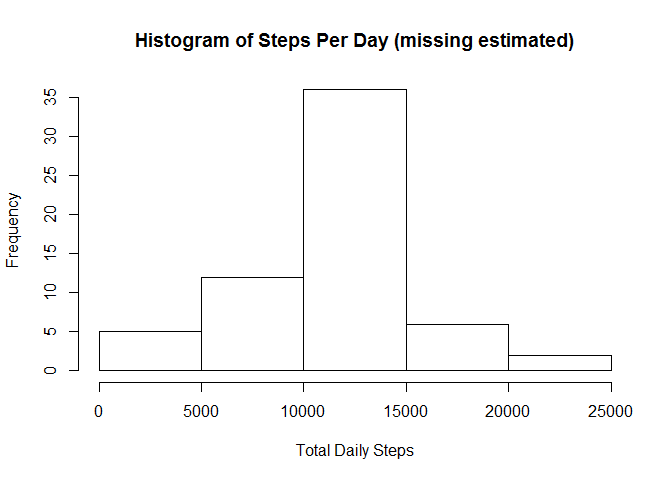
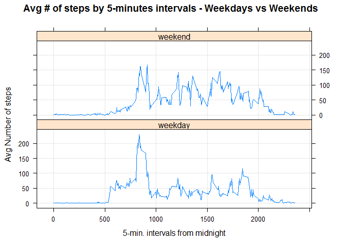

# Reproducible Research: Peer Assessment 1
## Assignment
It is now possible to collect a large amount of data about personal movement using activity monitoring devices such as a Fitbit, Nike Fuelband, or Jawbone Up. These type of devices are part of the "quantified self" movement - a group of enthusiasts who take measurements about themselves regularly to improve their health, to find patterns in their behavior, or because they are tech geeks. But these data remain under-utilized both because the raw data are hard to obtain and there is a lack of statistical methods and software for processing and interpreting the data.

This assignment makes use of data from a personal activity monitoring device. This device collects data at 5 minute intervals through out the day. The data consists of two months of data from an anonymous individual collected during the months of October and November, 2012 and include the number of steps taken in 5 minute intervals each day.

## Data

Data was downloaded from https://d396qusza40orc.cloudfront.net/repdata%2Fdata%2Factivity.zip on Sunday, July 19, 2015

The variables included in this dataset are:

steps: Number of steps taking in a 5-minute interval (missing values are coded as NA)

date: The date on which the measurement was taken in YYYY-MM-DD format

interval: Identifier for the 5-minute interval in which measurement was taken

The dataset is stored in a comma-separated-value (CSV) file and there are a total of 17,568 observations in this dataset.

## Loading and preprocessing the data


```r
## 0 Data Collection
      setwd("~/Data Science/data") ## Working Directory
      fileURL<- "https://d396qusza40orc.cloudfront.net/repdata%2Fdata%2Factivity.zip"

## Check to see if file exists
      if(file.exists("./repdata-data-activity.zip") == FALSE) { 
        download.file(fileURL, "./repdata-data-activity.zip", mode="wb")
      }

      if(file.exists("./activity.csv") == FALSE) {
        unzip("./repdata-data-activity.zip", unzip = "internal")
      }
```
Move the file from data science folder to the R Markdown working directory folder

```r
library(plyr)
library(ggplot2)
library(lattice)
#
activity<- read.csv("activity.csv")
activity$date<- as.POSIXct(activity$date)
summary(activity)
```

```
##      steps             date                        interval     
##  Min.   :  0.00   Min.   :2012-10-01 00:00:00   Min.   :   0.0  
##  1st Qu.:  0.00   1st Qu.:2012-10-16 00:00:00   1st Qu.: 588.8  
##  Median :  0.00   Median :2012-10-31 00:00:00   Median :1177.5  
##  Mean   : 37.38   Mean   :2012-10-31 00:25:34   Mean   :1177.5  
##  3rd Qu.: 12.00   3rd Qu.:2012-11-15 00:00:00   3rd Qu.:1766.2  
##  Max.   :806.00   Max.   :2012-11-30 00:00:00   Max.   :2355.0  
##  NA's   :2304
```

## What is mean total number of steps taken per day?

Missing values are ignored in the dataset for this section of analysis.

Calculate the total number of steps taken per day

```r
stepsPerDay<- aggregate(activity$steps, by=list(activity$date), FUN=sum, na.rm=TRUE)
names(stepsPerDay)<- c("date","steps")
```


The histogram illustrates the range of steps taken each day on the x axis and counts the number of days for each count.  For example, the graph shows the user took 0 steps on 10 days.

```r
hist(stepsPerDay$steps, main = "Histogram of Steps Per Day", xlab = "Total Daily Steps")
```

 

Mean, total number of steps taken per day

```
## [1] 9354.23
```

Median, total number of steps taken per day

```
## [1] 10395
```

## What is the average daily activity pattern?

This illustrates the averages steps taken for each 5-minute interval of the day, starting at midnight.  This will indicate the active parts of the day.


```r
## Create a data frame to analyze the data
meanIntervalSteps<- aggregate(x = activity$steps, by = list(activity$interval), FUN = mean, na.rm = TRUE)
names(meanIntervalSteps) <- c("interval","steps")

xyplot(steps ~ interval, data=meanIntervalSteps, type="l", grid=TRUE, ylab="Avg Number of steps", xlab="5-min. intervals from midnight", main="Average number of steps by 5-minutes intervals")
```

 

Which interval contains the most average steps?

```r
meanIntervalSteps[which.max(meanIntervalSteps$steps),c("interval")]
```

```
## [1] 835
```


## Imputing missing values
Calculating the number of missing values in the data set.


```r
nrow(activity[is.na(activity$steps),])
```

```
## [1] 2304
```


I will use the average steps per interval to replace the missing values.


```r
allActivity<- activity
for(r in 1:nrow(allActivity)){
  if (is.na(allActivity$steps[r])) {
    repl<- meanIntervalSteps$steps[meanIntervalSteps$interval == allActivity$interval[r]];
    allActivity$steps[r]<- repl;
  }
}
```


Calculate the total number of steps taken per day with missing data estimated

```r
allstepsPerDay<- aggregate(allActivity$steps, by = list(allActivity$date), sum, na.rm = TRUE)
names(allstepsPerDay)<- c("date","steps")
```


The histogram illustrates the range of steps taken each day on the x axis and counts the number of days for each count.  For example, the graph shows the user took 0 steps on 10 days.

```r
hist(allstepsPerDay$steps, main = "Histogram of Steps Per Day (missing estimated)", xlab = "Total Daily Steps")
```

 

Mean, total number of steps taken per day

```
## [1] 10766.19
```

Median, total number of steps taken per day

```
## [1] 10766.19
```

Do these values differ from the estimates from the first part of the assignment?

- The shape of the histogram remains very similar.
- The mean and median increase since the "NAs" have values.
- The mean and median have the same value because the missing values were assigned the average value.

What is the impact of imputing missing data on the estimates of the total daily number of steps?

- The number of steps increase since missing values have been assigned "average" value.


## Are there differences in activity patterns between weekdays and weekends?

Create a new factor variable in the dataset with two levels - "weekday" and "weekend" indicating whether a given date is a weekday or weekend day.


```r
## Add "day" to dataset and default value to "weekday"
allActivity$day<-"weekday"
allActivity$day[weekdays(as.Date(allActivity$date), abb = T) %in% c("Sat","Sun")] <- "weekend"
```


Weekend vs Weekday plot
The graph illustrates the subject starts walking later on the weekend than the weekday.


```r
## Create a data frame to analyze the data
allmeanIntervalSteps<- aggregate(x = allActivity$steps, by = list(allActivity$interval, allActivity$day), FUN = mean, na.rm = TRUE)
names(allmeanIntervalSteps) <- c("interval","day","steps")

xyplot(steps ~ interval | day, data=allmeanIntervalSteps, type="l", grid=TRUE, layout=c(1,2), ylab="Avg Number of steps", xlab="5-min. intervals from midnight", main="Average number of steps by 5-minutes intervals - Weekdays vs Weekends")
```

 
